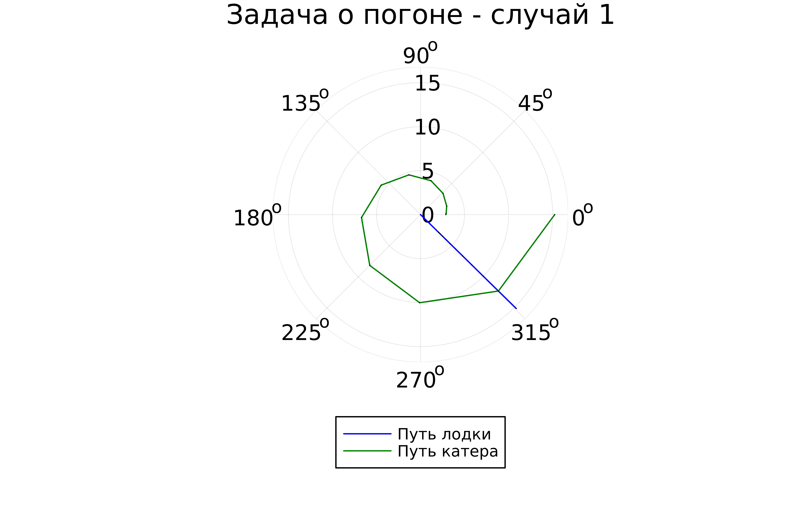

---
## Front matter
lang: ru-RU
title: Лабораторная работа №2
subtitle: Задача о погоне
author:
  - Крутова Е. Д.
institute:
  - Российский университет дружбы народов, Москва, Россия
date: 10 февраля 2024

## i18n babel
babel-lang: russian
babel-otherlangs: english

babel-lang: russian 
babel-otherlangs: english 
mainfont: Arial 
monofont: Courier New 
fontsize: 12pt

## Formatting pdf
toc: false
toc-title: Содержание
slide_level: 2
aspectratio: 169
section-titles: true
theme: metropolis
header-includes:
 - \metroset{progressbar=frametitle,sectionpage=progressbar,numbering=fraction}
 - '\makeatletter'
 - '\beamer@ignorenonframefalse'
 - '\makeatother'
---

# Цель работы

Изучить основы языков программирования Julia и OpenModelica. Освоить библиотеки этих языков, которые используются для построения графиков и решения дифференциальных уравнений. Решить задачу о погоне.

# Задание

1.	Запишите уравнение, описывающее движение катера, с начальными условиями для двух случаев (в зависимости от расположения катера относительно лодки в начальный момент времени).
2.	Постройте траекторию движения катера и лодки для двух случаев.
3.	Найдите точку пересечения траектории катера и лодки.

{#fig:001 width=40%}

# Выполнение работы

1.	Примем за момент отсчета времени момент первого рассеивания тумана. Введем полярные координаты с центром в точке нахождения браконьеров и осью, проходящей через катер береговой охраны. Тогда начальные координаты катера (14.1; 0). Обозначим скорость лодки v.
2.	Траектория катера должна быть такой, чтобы и катер, и лодка все время были на одном расстоянии от полюса. Только в этом случае траектория катера пересечется с траекторией лодки. Поэтому для начала катер береговой охраны должен двигаться некоторое время прямолинейно, пока не окажется на том же расстоянии от полюса, что и лодка браконьеров. После этого катер береговой охраны должен двигаться вокруг полюса удаляясь от него с той же скоростью, что и лодка браконьеров.

# Выполнение работы (2)

3.	Чтобы найти расстояние x (расстояние после которого катер начнет двигаться вокруг полюса), необходимо составить следующие уравнение. Пусть через время t катер и лодка окажутся на одном расстоянии x от полюса. За это время лодка пройдет x, а катер 14.1+x (или 14.1−x, в зависимости от начального положения катера относительно полюса).

x1 = 141/49, x2 = 141/49

# Поиск тангенциальной скорости

{#fig:002 width=70%}

# Решение

{#fig:006 width=50%}

{#fig:008 width=50%}

# Решение с помощью программ (1)

{#fig:009 width=50%}

# Решение с помощью программ (2)

{#fig:010 width=50%}

# Вывод

Были изучены основы языков программирования Julia и OpenModelica. Освоены библиотеки этих языков, которые используются для построения графиков и решения дифференциальных уравнений. Поскольку OpenModelica не работает с полярными координатами, она пока что не была использована в данной лабораторной работе.
