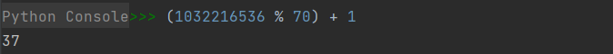
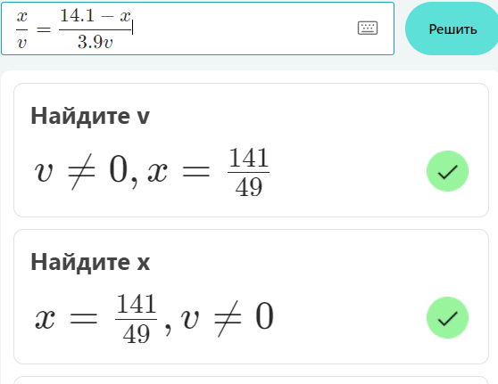
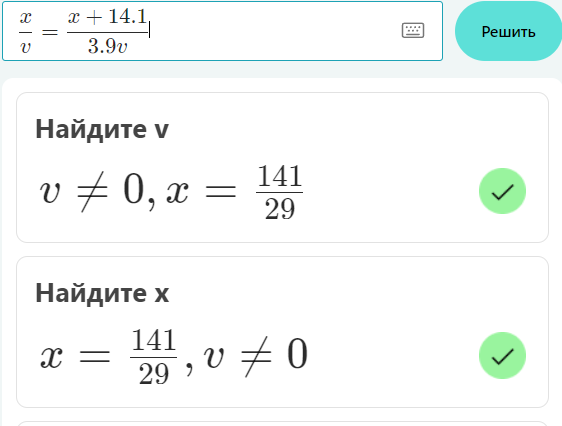
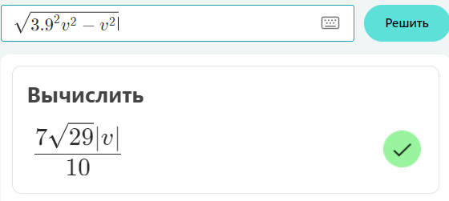
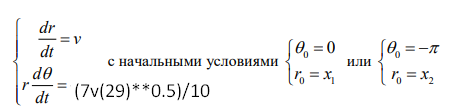
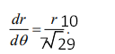
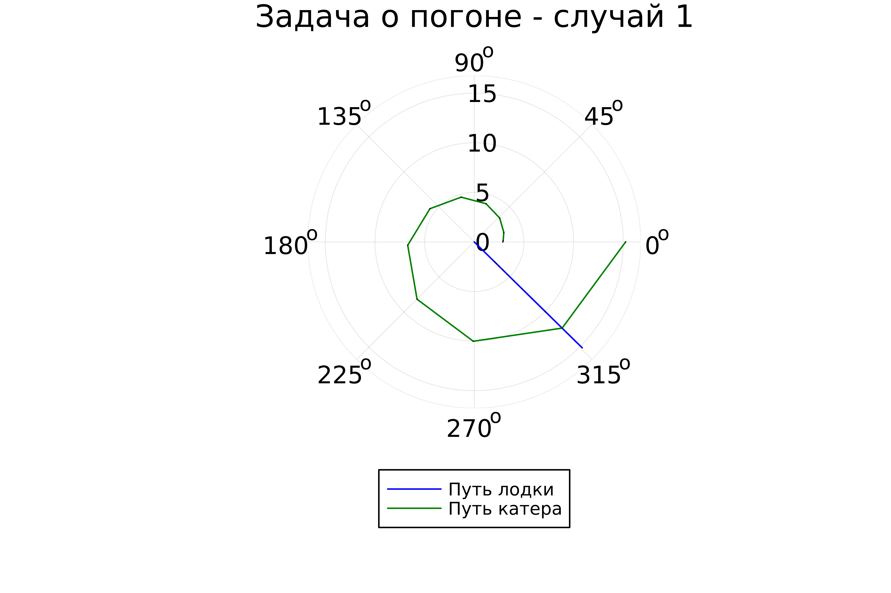
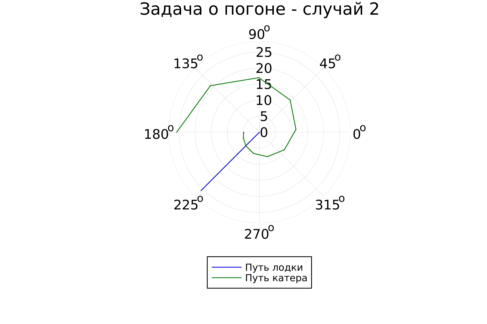

---
## Front matter
title: "Лабораторная работа №2"
subtitle: "Задача о погоне"
author: "Крутова Екатерина Дмитриевна, НПИбд-01-21"

## Generic otions
lang: ru-RU
toc-title: "Содержание"

## Bibliography
bibliography: bib/cite.bib
csl: pandoc/csl/gost-r-7-0-5-2008-numeric.csl

## Pdf output format
toc: true # Table of contents
toc-depth: 2
lof: true # List of figures
lot: true # List of tables
fontsize: 12pt
linestretch: 1.5
papersize: a4
documentclass: scrreprt
## I18n polyglossia
polyglossia-lang:
  name: russian
  options:
	- spelling=modern
	- babelshorthands=true
polyglossia-otherlangs:
  name: english
## I18n babel
babel-lang: russian
babel-otherlangs: english
## Fonts
mainfont: PT Serif
romanfont: PT Serif
sansfont: PT Sans
monofont: PT Mono
mainfontoptions: Ligatures=TeX
romanfontoptions: Ligatures=TeX
sansfontoptions: Ligatures=TeX,Scale=MatchLowercase
monofontoptions: Scale=MatchLowercase,Scale=0.9
## Biblatex
biblatex: true
biblio-style: "gost-numeric"
biblatexoptions:
  - parentracker=true
  - backend=biber
  - hyperref=auto
  - language=auto
  - autolang=other*
  - citestyle=gost-numeric
## Pandoc-crossref LaTeX customization
figureTitle: "Рис."
tableTitle: "Таблица"
listingTitle: "Листинг"
lofTitle: "Список иллюстраций"
lotTitle: "Список таблиц"
lolTitle: "Листинги"
## Misc options
indent: true
header-includes:
  - \usepackage{indentfirst}
  - \usepackage{float} # keep figures where there are in the text
  - \floatplacement{figure}{H} # keep figures where there are in the text
---

# Цель работы

Изучить основы языков программирования Julia и OpenModelica. Освоить библиотеки этих языков, которые используются для построения графиков и решения дифференциальных уравнений. Решить задачу о погоне.

# Задание

1. Запишите уравнение, описывающее движение катера, с начальными условиями для двух случаев (в зависимости от расположения катера относительно лодки в начальный момент времени).
2. Постройте траекторию движения катера и лодки для двух случаев.
3. Найдите точку пересечения траектории катера и лодки.

В соответствии с формулой  (Sn mod N)+1, где Sn — номер студбилета, N — количество заданий, я взяла вариант 37 (рис. [-@fig:001]).

{#fig:001 width=70%}

# Теоретическое введение

Julia — высокоуровневый высокопроизводительный свободный язык программирования с динамической типизацией, созданный для математических вычислений. Эффективен также и для написания программ общего назначения. Синтаксис языка схож с синтаксисом других математических языков (например, MATLAB и Octave), однако имеет некоторые существенные отличия. Julia написан на Си, C++ и Scheme. Имеет встроенную поддержку многопоточности и распределённых вычислений, реализованные в том числе в стандартных конструкциях.

Физические термины:

• Тангенциальная скорость - составляющая вектора скорости, перпендикулярная линии, соединяющей источник и наблюдателя. Измеряется собственному движению - угловому перемещению источника.

• Радиальная скорость — проекция скорости точки на прямую, соединяющую её с выбранным началом координат.

• Полярная система координат — двумерная система координат, в которой каждая точка на плоскости определяется двумя числами — полярным углом и полярным радиусом.

# Выполнение лабораторной работы

## Математическая модель
1. Примем за момент отсчета времени момент первого рассеивания тумана. Введем полярные координаты с центром в точке нахождения браконьеров и осью, проходящей через катер береговой охраны. Тогда начальные координаты катера (14.1; 0). Обозначим скорость лодки v.

2. Траектория катера должна быть такой, чтобы и катер, и лодка все время были на одном расстоянии от полюса. Только в этом случае траектория катера пересечется с траекторией лодки. Поэтому для начала катер береговой охраны должен двигаться некоторое время прямолинейно, пока не окажется на том же расстоянии от полюса, что и лодка браконьеров. После этого катер береговой охраны должен двигаться вокруг полюса удаляясь от него с той же скоростью, что и лодка браконьеров.

3. Чтобы найти расстояние x (расстояние после которого катер начнет двигаться вокруг полюса), необходимо составить следующие уравнение. Пусть через время t катер и лодка окажутся на одном расстоянии x от полюса. За это время лодка пройдет x, а катер 14.1+x (или 14.1−x, в зависимости от начального положения катера относительно полюса). Время, за которое они пройдут это расстояние, вычисляется как рис. [-@fig:002].

{#fig:002 width=70%}

Или как рис. [-@fig:003].

{#fig:003 width=70%}

Так как время должно быть одинаковым, эти величины тоже будут друг другу равны. Из этого получаем объединение из двух уравнений (двух из-за двух разных изначальных позиций катера относительно полюса).

Задачу будем решать для двух случаев. После того, как катер береговой охраны окажется на одном расстоянии от полюса, что и лодка, он должен сменить прямолинейную траекторию и начать двигаться вокруг полюса удаляясь от него со скоростью лодки v. Для этого скорость катера раскладываем на две составляющие: радиальная скорость и тангенциальная скорость (рис. [-@fig:004]).

{#fig:004 width=70%}

Решение исходной задачи (рис. [-@fig:005] - [-@fig:006]):

{#fig:005 width=70%}

{#fig:006 width=70%}

## Решение с помощью программ

**OpenModelica**

К сожалению, OpenModelica не адаптирована к использованию полярных координат, поэтому адекватное отображение результатов данный задачи там невозможно. [1]

**Julia**

Решить дифференциальное уравнение, расписанное в постановке задачи лабораторной работы, поможет библиотека DifferentialEquations. Итоговые изображения в полярных координатах будут строиться через библиотеку Plots. [2]

Для начала нужно установить Julia (рис. [-@fig:007])

{#fig:007 width=70%}

Код программы:

```

using Plots
using DifferentialEquations

const a = 14.1
const n = 3.9

const r0 = a/(n + 1)
const r0_2 = a/(n - 1)

const T = (0, 2*pi)
const T_2 = (-pi, pi)

function F(u, p, t)
    return u / sqrt(n*n - 1)
end

problem = ODEProblem(F, r0, T)

result = solve(problem, abstol=1e-8, reltol=1e-8)
@show result.u
@show result.t

dxR = rand(1:size(result.t)[1])
rAngles = [result.t[dxR] for i in 1:size(result.t)[1]]

plt = plot(proj=:polar, aspect_ratio=:equal, dpi = 1000, legend=true, bg=:white)

plot!(plt, xlabel="theta", ylabel="r(t)", title="Задача о погоне - случай 1", legend=:outerbottom)
plot!(plt, [rAngles[1], rAngles[2]], [0.0, result.u[size(result.u)[1]]], label="Путь лодки", color=:blue, lw=1)
scatter!(plt, rAngles, result.u, label="", mc=:blue, ms=0.0005)
plot!(plt, result.t, result.u, xlabel="theta", ylabel="r(t)", label="Путь катера", color=:green, lw=1)
scatter!(plt, result.t, result.u, label="", mc=:green, ms=0.0005)

savefig(plt, "lab02_01.png")

problem = ODEProblem(F, r0_2 , T_2)
result = solve(problem, abstol=1e-8, reltol=1e-8)
dxR = rand(1:size(result.t)[1])
rAngles = [result.t[dxR] for i in 1:size(result.t)[1]]

plt1 = plot(proj=:polar, aspect_ratio=:equal, dpi = 1000, legend=true, bg=:white)

plot!(plt1, xlabel="theta", ylabel="r(t)", title="Задача о погоне - случай 2", legend=:outerbottom)
plot!(plt1, [rAngles[1], rAngles[2]], [0.0, result.u[size(result.u)[1]]], label="Путь лодки", color=:blue, lw=1)
scatter!(plt1, rAngles, result.u, label="", mc=:blue, ms=0.0005)
plot!(plt1, result.t, result.u, xlabel="theta", ylabel="r(t)", label="Путь катера", color=:green, lw=1)
scatter!(plt1, result.t, result.u, label="", mc=:green, ms=0.0005)

savefig(plt1, "lab02_02.png")

```

Итоговые графики траектории движения катера и лодки для случая обоих случаев.: (рис. [-@fig:008] - [-@fig:009])

{#fig:008 width=70%}

{#fig:009 width=70%}

# Выводы

Были изучены основы языков программирования Julia и OpenModelica. Освоены библиотеки этих языков, которые используются для построения графиков и решения дифференциальных уравнений. Поскольку OpenModelica не работает с полярными координатами, она пока что не была использована в данной лабораторной работе.

# Список литературы

[1] Документация по OpenModelica: https://openmodelica.org/

[2] Документация по Julia: https://docs.julialang.org/en/v1/
