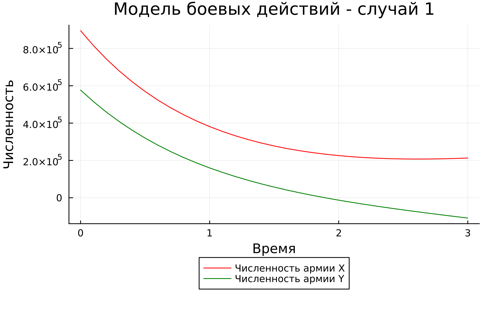
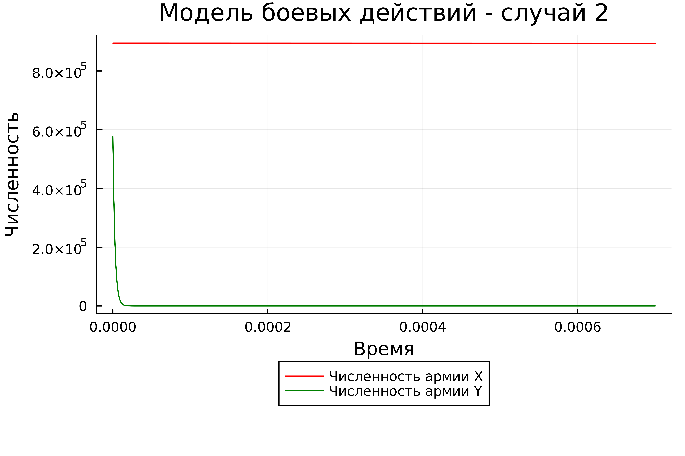
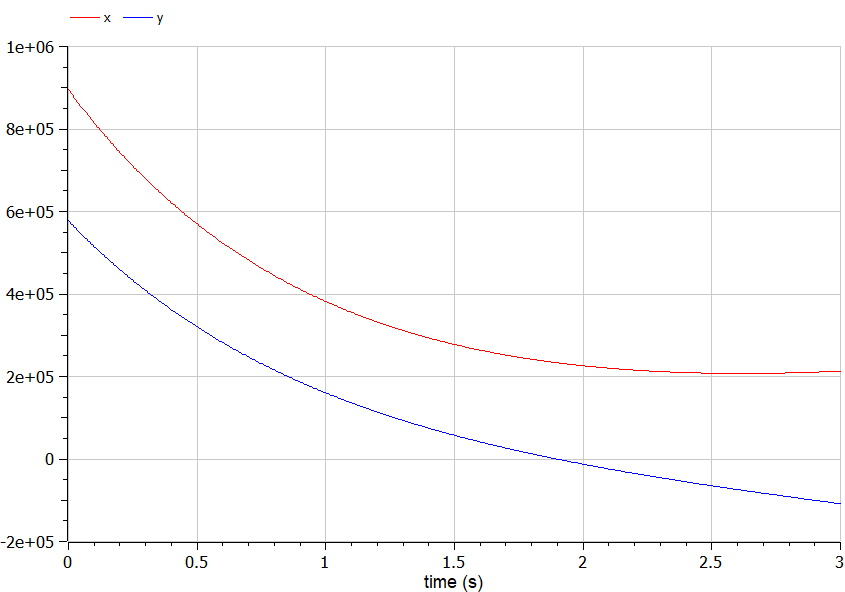
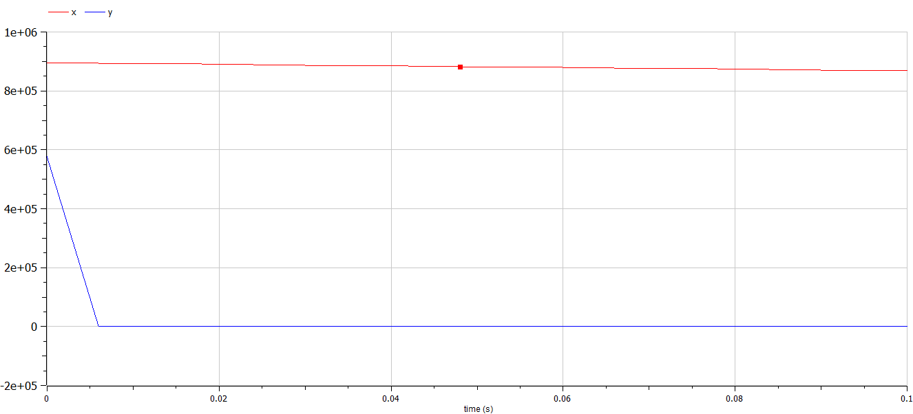

---
## Front matter
lang: ru-RU
title: Лабораторная работа №3
subtitle: "Модель боевых действий"
author:
  - Крутова Е. Д.
institute:
  - Российский университет дружбы народов, Москва, Россия
date: 24 февраля 2024

## i18n babel
babel-lang: russian
babel-otherlangs: english
mainfont: Arial 
monofont: Courier New 
fontsize: 12pt

## Formatting pdf
toc: false
toc-title: Содержание
slide_level: 2
aspectratio: 169
section-titles: true
theme: metropolis
header-includes:
 - \metroset{progressbar=frametitle,sectionpage=progressbar,numbering=fraction}
 - '\makeatletter'
 - '\beamer@ignorenonframefalse'
 - '\makeatother'
---

# Цель работы

Изучить модели боевых действий Ланчестера. Применить их на практике для решения задания лабораторной работы.

# Задание

1) Построить модель боевых действий между регулярными войсками на языках Julia и OpenModelica;
2) Построить модель ведения боевых действий с участием регулярных войск и партизанских отрядов на языках Julia и OpenModelica.

{#fig:001 width=40%}

# Выполнение работы

Между страной Х и страной У идет война. Численность состава войск исчисляется от начала войны, и являются временными функциями x(t) и y(t). В начальный момент времени страна Х имеет армию численностью 895000 человек, а в распоряжении страны У армия численностью в 577000 человек. Для упрощения модели считаем, что коэффициенты a, b, c, h постоянны. Также считаем P(t) и Q(t) непрерывные функции.

# Выполнение работы (2)

{#fig:002 width=70%}

# Решение с помощью Julia (1)

{#fig:003 width=70%}

# Решение с помощью Julia (2)

{#fig:004 width=70%}

# Решение с помощью OpenModelica (1)

{#fig:005 width=70%}

# Решение с помощью OpenModelica (2)

{#fig:006 width=70%}

# Вывод

Я построила по две модели на языках Julia и OpenModelica.Построение моделей боевых действий на языке OpenModelica занимает гораздо меньше строк и времени, чем аналогичное построение на языке Julia.
