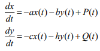
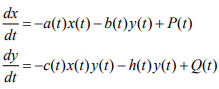
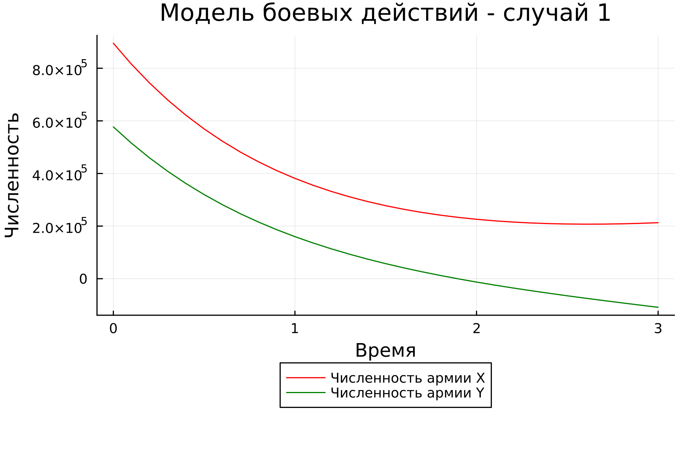
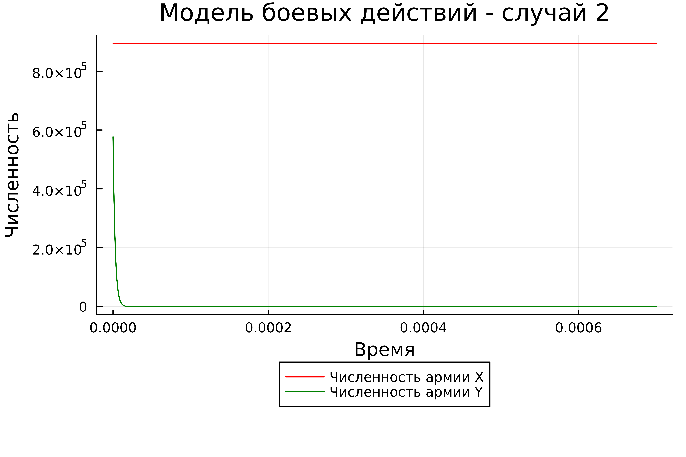
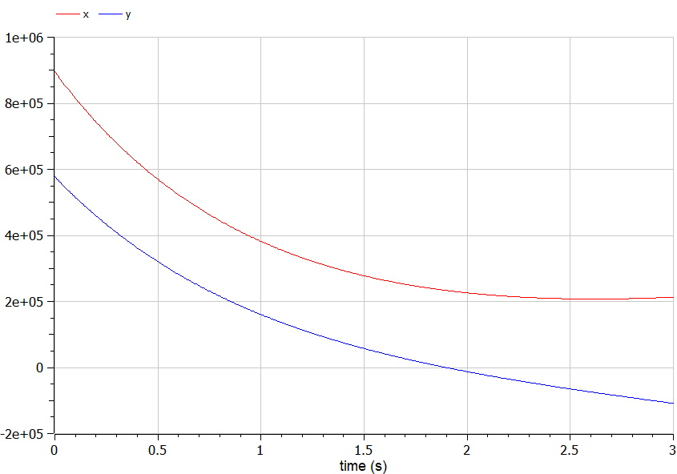
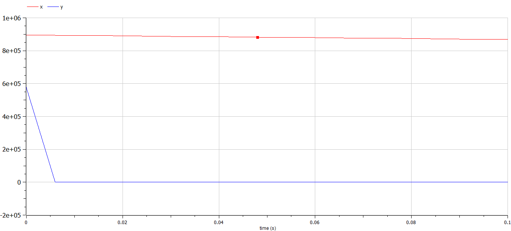

---
## Front matter
title: "Лабораторная работа №2"
subtitle: "Модель боевых действий"
author: "Крутова Екатерина Дмитриевна, НПИбд-01-21"

## Generic otions
lang: ru-RU
toc-title: "Содержание"

## Bibliography
bibliography: bib/cite.bib
csl: pandoc/csl/gost-r-7-0-5-2008-numeric.csl

## Pdf output format
toc: true # Table of contents
toc-depth: 2
lof: true # List of figures
lot: true # List of tables
fontsize: 12pt
linestretch: 1.5
papersize: a4
documentclass: scrreprt
## I18n polyglossia
polyglossia-lang:
  name: russian
  options:
	- spelling=modern
	- babelshorthands=true
polyglossia-otherlangs:
  name: english
## I18n babel
babel-lang: russian
babel-otherlangs: english
## Fonts
mainfont: PT Serif
romanfont: PT Serif
sansfont: PT Sans
monofont: PT Mono
mainfontoptions: Ligatures=TeX
romanfontoptions: Ligatures=TeX
sansfontoptions: Ligatures=TeX,Scale=MatchLowercase
monofontoptions: Scale=MatchLowercase,Scale=0.9
## Biblatex
biblatex: true
biblio-style: "gost-numeric"
biblatexoptions:
  - parentracker=true
  - backend=biber
  - hyperref=auto
  - language=auto
  - autolang=other*
  - citestyle=gost-numeric
## Pandoc-crossref LaTeX customization
figureTitle: "Рис."
tableTitle: "Таблица"
listingTitle: "Листинг"
lofTitle: "Список иллюстраций"
lotTitle: "Список таблиц"
lolTitle: "Листинги"
## Misc options
indent: true
header-includes:
  - \usepackage{indentfirst}
  - \usepackage{float} # keep figures where there are in the text
  - \floatplacement{figure}{H} # keep figures where there are in the text
---

# Цель работы

Изучить модели боевых действий Ланчестера. Применить их на практике для решения задания лабораторной работы.

# Задание

Между страной Х и страной У идет война. Численность состава войск исчисляется от начала войны, и являются временными функциями x(t) и y(t). В начальный момент времени страна Х имеет армию численностью 895000 человек, а в распоряжении страны У армия численностью в 577000 человек. Для упрощения модели считаем, что коэффициенты a, b, c, h постоянны. Также считаем P(t) и Q(t) непрерывные функции.

1) Построить модель боевых действий между регулярными войсками на языках Julia и OpenModelica;
2) Построить модель ведения боевых действий с участием регулярных войск и партизанских отрядов на языках Julia и OpenModelica.

В соответствии с формулой  (Sn mod N)+1, где Sn — номер студбилета, N — количество заданий, я взяла вариант 37 (рис. [-@fig:001]).

{#fig:001 width=70%}

# Теоретическое введение

Законы Ланчестера (законы Осипова — Ланчестера) — математическая формула для расчета относительных сил пары сражающихся сторон — подразделений вооруженных сил

Уравнения Ланчестера — это дифференциальные уравнения, описывающие зависимость между силами сражающихся сторон A и D как функцию от времени, причем функция зависит только от A и D.

В 1916 году, в разгар первой мировой войны, Фредерик Ланчестер разработал систему дифференциальных уравнений для демонстрации соотношения между противостоящими силами. Среди них есть так называемые Линейные законы Ланчестера (первого рода или честного боя, для рукопашного боя или неприцельного огня) и Квадратичные законы Ланчестера (для войн начиная с XX века с применением прицельного огня, дальнобойных орудий, огнестрельного оружия). В связи с установленным приоритетом в англоязычной литературе наметилась тенденция перехода от фразы «модель Ланчестера» к «модели Осипова — Ланчестера». [1]

Модель боевых действий между регулярными войсками описывается следующим образом (рис. [-@fig:002]):

{#fig:002 width=70%}

Модель ведение боевых действий с участием регулярных войск и партизанских отрядов имеет вид (рис. [-@fig:003]):

{#fig:003 width=70%}

# Выполнение лабораторной работы

Для построения моделей использовались Julia и OpenModelica.

Код Julia:

```
using Plots;
using DifferentialEquations;

function one(du, u, p, t)
    du[1] = - 0.34*u[1] - 0.93*u[2] + 2*sin(t)
    du[2] = - 0.54*u[1] - 0.29*u[2] + cos(t) + 3
end

function two(du, u, p, t)
    du[1] = - 0.31*u[1] - 0.88*u[2] + 2*sin(2*t)
    du[2] = - 0.41*(u[1] + 1)*u[2] + cos(t) + 3
end

const people = Float64[895000, 577000]
const prom1 = [0.0, 3.0]
const prom2 = [0.0, 0.0007]

prob1 = ODEProblem(one, people, prom1)
prob2 = ODEProblem(two, people, prom2)

sol1 = solve(prob1, dtmax=0.1)
sol2 = solve(prob2, dtmax=0.000001)

A1 = [u[1] for u in sol1.u]
A2 = [u[2] for u in sol1.u]
T1 = [t for t in sol1.t]
A3 = [u[1] for u in sol2.u]
A4 = [u[2] for u in sol2.u]
T2 = [t for t in sol2.t]

plt1 = plot(dpi = 300, legend= true, bg =:white)
plot!(plt1, xlabel="Время", ylabel="Численность", title="Модель боевых действий - случай 1", legend=:outerbottom)
plot!(plt1, T1, A1, label="Численность армии X", color =:red)
plot!(plt1, T1, A2, label="Численность армии Y", color =:green)
savefig(plt1, "lab03_1.png")

plt2 = plot(dpi = 1200, legend= true, bg =:white)
plot!(plt2, xlabel="Время", ylabel="Численность", title="Модель боевых действий - случай 2", legend=:outerbottom)
plot!(plt2, T2, A3, label="Численность армии X", color =:red)
plot!(plt2, T2, A4, label="Численность армии Y", color =:green)
savefig(plt2, "lab03_2.png")
```

Код OpenModelica (1):

```
model lab3open_1 
Real x;
Real y;
Real a = 0.34;
Real b = 0.93;
Real c = 0.54;
Real d = 0.29;
Real t = time;
initial equation
x = 895000;
y = 577000;
equation
der(x) = -a*x - b*y + 2*sin(t);
der(y) = -c*x - d*y + cos(t) + 3;
end lab3open_1;
```

Код OpenModelica (2):

```
model lab3open_2
Real x;
Real y;
Real a = 0.31;
Real b = 0.88;
Real c = 0.41;
Real d = 0.41;
Real t = time;
initial equation
x = 895000;
y = 577000;
equation
der(x) = -a*x - b*y + 2*sin(2*t);
der(y) = -c*x*y - d*y + cos(t)+3;
end lab3open_2;
```

Построенные модели Julia (рис. [-@fig:004] - [-@fig:005])

{#fig:004 width=70%}

{#fig:005 width=70%}

Построенные модели OpenModelica (рис. [-@fig:006] - [-@fig:007])

{#fig:006 width=70%}

{#fig:007 width=70%}

Построенные графики идентичны.

# Выводы

Я построила по две модели на языках Julia и OpenModelica.Построение моделей боевых действий на языке OpenModelica занимает гораздо меньше строк и времени, чем аналогичное построение на языке Julia.

# Список литературы

[1] Законы Ланчестера: <https://ru.wikipedia.org/wiki/%D0%97%D0%B0%D0%BA%D0%BE%D0%BD%D1%8B_%D0%9E%D1%81%D0%B8%D0%BF%D0%BE%D0%B2%D0%B0_%E2%80%94_%D0%9B%D0%B0%D0%BD%D1%87%D0%B5%D1%81%D1%82%D0%B5%D1%80%D0%B0>
