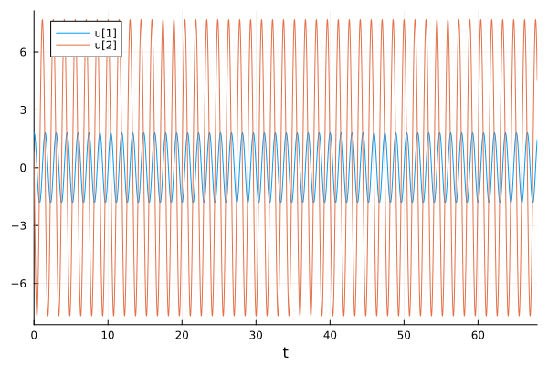
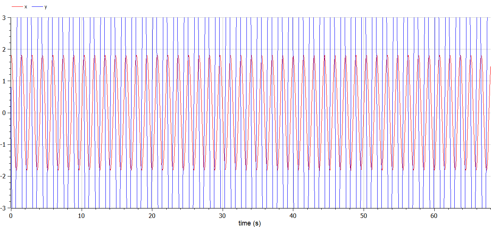
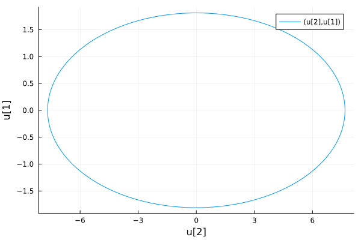
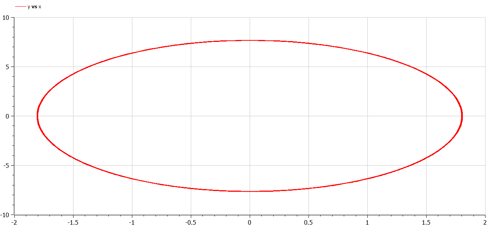

---
## Front matter
lang: ru-RU
title: Лабораторная работа №4
subtitle: "Модель гармонических колебаний"
author:
  - Крутова Е. Д.
institute:
  - Российский университет дружбы народов, Москва, Россия
date: 2 марта 2024

## i18n babel
babel-lang: russian
babel-otherlangs: english
mainfont: Arial 
monofont: Courier New 
fontsize: 8pt

## Formatting pdf
toc: false
toc-title: Содержание
slide_level: 2
aspectratio: 169
section-titles: true
theme: metropolis
header-includes:
 - \metroset{progressbar=frametitle,sectionpage=progressbar,numbering=fraction}
 - '\makeatletter'
 - '\beamer@ignorenonframefalse'
 - '\makeatother'
---

# Цель работы

Изучить понятие гармонического осциллятора, построить фазовый портрет и найти решение уравнения гармонического осциллятора.

# Задание

Постройте фазовый портрет гармонического осциллятора и решение уравнения гармонического осциллятора для следующих случаев

1. Колебания гармонического осциллятора без затуханий и без действий внешней силы x'' + 18x = 0
2. Колебания гармонического осциллятора c затуханием и без действий внешней силы x'' + 18x' + 9x = 0
3. Колебания гармонического осциллятора c затуханием и под действием внешней силы x'' + 8x' + 16x = 0.5cos(t)

На интервале t [0; 68] (шаг 0.05) с начальными условиями x_0 = 1.8, y_0 = 0.8

{#fig:001 width=40%}

# Выполнение работы

{#fig:002 width=50%}

# Выполнение работы (2)

{#fig:003 width=35%}

{#fig:004 width=35%}

# Выполнение работы (3)

{#fig:005 width=35%}

{#fig:006 width=35%}

# Вывод

В ходе выполнения лабораторной работы были построены решения уравнения гармонического осциллятора и фазовые портреты гармонических колебаний без затухания, с затуханием и при действии внешней силы на языках Julia и Open Modelica.

# Вопросы к лабораторной работе 

1. Запишите простейшую модель гармонических колебаний

x = x_m cos (ωt + φ0).

2. Дайте определение осциллятора

Осциллятор — система, совершающая колебания, то есть показатели которой периодически повторяются во времени.

3. Запишите модель математического маятника

4. Что такое фазовый портрет и фазовая траектория?

Фазовая траектория — след от движения изображающей точки.

Фазовый портрет — это полная совокупность различных фазовых траекторий. Он хорошо иллюстрирует поведение системы и основные ее свойства, такие как точки равновесия.