---
## Front matter
title: "Лабораторная работа №4"
subtitle: "Модель гармонических колебаний"
author: "Крутова Екатерина Дмитриевна, НПИбд-01-21"

## Generic otions
lang: ru-RU
toc-title: "Содержание"

## Bibliography
bibliography: bib/cite.bib
csl: pandoc/csl/gost-r-7-0-5-2008-numeric.csl

## Pdf output format
toc: true # Table of contents
toc-depth: 2
lof: true # List of figures
lot: true # List of tables
fontsize: 12pt
linestretch: 1.5
papersize: a4
documentclass: scrreprt
## I18n polyglossia
polyglossia-lang:
  name: russian
  options:
	- spelling=modern
	- babelshorthands=true
polyglossia-otherlangs:
  name: english
## I18n babel
babel-lang: russian
babel-otherlangs: english
## Fonts
mainfont: PT Serif
romanfont: PT Serif
sansfont: PT Sans
monofont: PT Mono
mainfontoptions: Ligatures=TeX
romanfontoptions: Ligatures=TeX
sansfontoptions: Ligatures=TeX,Scale=MatchLowercase
monofontoptions: Scale=MatchLowercase,Scale=0.9
## Biblatex
biblatex: true
biblio-style: "gost-numeric"
biblatexoptions:
  - parentracker=true
  - backend=biber
  - hyperref=auto
  - language=auto
  - autolang=other*
  - citestyle=gost-numeric
## Pandoc-crossref LaTeX customization
figureTitle: "Рис."
tableTitle: "Таблица"
listingTitle: "Листинг"
lofTitle: "Список иллюстраций"
lotTitle: "Список таблиц"
lolTitle: "Листинги"
## Misc options
indent: true
header-includes:
  - \usepackage{indentfirst}
  - \usepackage{float} # keep figures where there are in the text
  - \floatplacement{figure}{H} # keep figures where there are in the text
---

# Цель работы

Изучить понятие гармонического осциллятора, построить фазовый портрет и найти решение уравнения гармонического осциллятора.

# Задание

Постройте фазовый портрет гармонического осциллятора и решение уравнения гармонического осциллятора для следующих случаев

1. Колебания гармонического осциллятора без затуханий и без действий внешней силы x'' + 18x = 0
2. Колебания гармонического осциллятора c затуханием и без действий внешней силы x'' + 18x' + 9x = 0
3. Колебания гармонического осциллятора c затуханием и под действием внешней силы x'' + 8x' + 16x = 0.5cos(t)

На интервале t [0; 68] (шаг 0.05) с начальными условиями x_0 = 1.8, y_0 = 0.8

В соответствии с формулой  (Sn mod N)+1, где Sn — номер студбилета, N — количество заданий, я взяла вариант 37 (рис. [-@fig:001]).

{#fig:001 width=70%}

# Теоретическое введение

- Гармонический осциллятор [1] — система, которая при смещении из положения равновесия испытывает действие возвращающей силы F, пропорциональной смещению x.

- Гармоническое колебание - колебание, в процессе которого величины, характеризующие движение (смещение, скорость, ускорение и др.), изменяются по закону синуса или косинуса (гармоническому закону).

# Выполнение лабораторной работы

## Выполнение с помощью Julia

Код 1 случая (Колебания гармонического осциллятора без затуханий и без действий внешней силы):

```
  # x'' + 18x = 0
  using DifferentialEquations

  function lorenz!(du, u, p, t)
      a = p
      du[1] = u[2]
      du[2] = -a*u[1]
  end

  const x = 1.8
  const y = 0.8
  u0 = [x, y]

  p = (18)
  tspan = (0.0, 68.0)
  prob = ODEProblem(lorenz!, u0, tspan, p)
  sol = solve(prob, dtmax = 0.05)

  using Plots; gr()

  #решение системы уравнений
  plot(sol)
  savefig("lab4_julia_1.png")

  #фазовый портрет
  plot(sol, vars=(2,1))
  savefig("lab4_julia_1_ph.png")
```

Код 2 случая (Колебания гармонического осциллятора c затуханием и без действий внешней силы):

```
# x'' + 18x' + 9x = 0
using DifferentialEquations

function lorenz!(du, u, p, t)
    a, b = p
    du[1] = u[2]
    du[2] = -a*du[1] - b*u[1] 
end

const x = 1.8
const y = 0.8
u0 = [x, y]

p = (sqrt(18), 9)
tspan = (0.0, 68.0)
prob = ODEProblem(lorenz!, u0, tspan, p)
sol = solve(prob, dtmax = 0.05)

using Plots; gr()

#решение системы уравнений
plot(sol)
savefig("lab4_julia_2.png")

#фазовый портрет
plot(sol, vars=(2,1))
savefig("lab4_julia_2_ph.png")
```

Код 3 случая ( Колебания гармонического осциллятора c затуханием и под действием внешней силы)

```
# x'' + 8x' + 16x = 0.5cos(3t)
using DifferentialEquations

function lorenz!(du, u, p, t)
    a, b = p
    du[1] = u[2]
    du[2] = -a*du[1] - b*u[1] + 0.5*cos(3*t)
end

const x = 1.8
const y = 0.8
u0 = [x, y]

p = (sqrt(8), 16)
tspan = (0.0, 68.0)
prob = ODEProblem(lorenz!, u0, tspan, p)
sol = solve(prob, dtmax = 0.05)

using Plots; gr()

#решение системы уравнений
plot(sol)
savefig("lab4_julia_3.png")

#фазовый портрет
plot(sol, vars=(2,1))
savefig("lab4_julia_3_ph.png")
```

Полученные графики (рис. [-@fig:002] - [-@fig:007]).

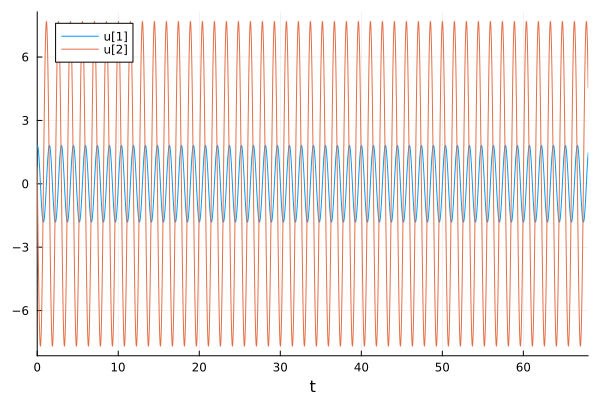{#fig:002 width=70%}

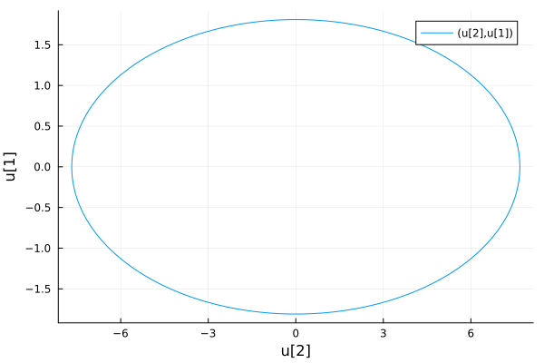{#fig:003 width=70%}

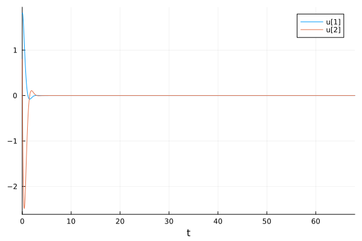{#fig:004 width=70%}

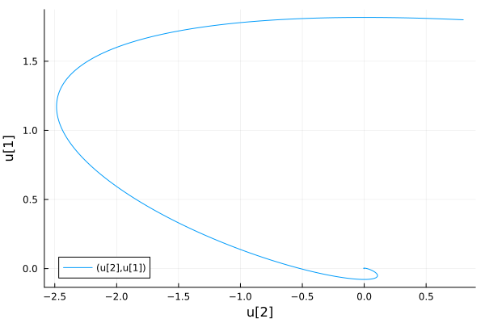{#fig:005 width=70%}

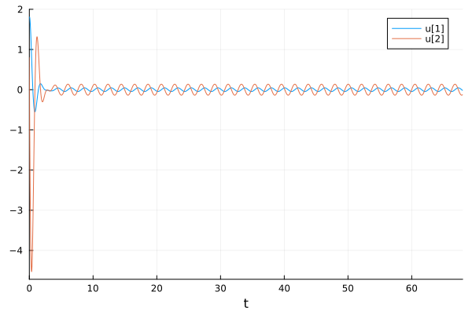{#fig:006 width=70%}

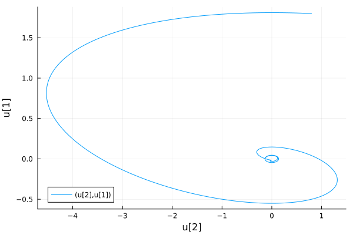{#fig:007 width=70%}

## Выполнение с помощью OpenModelica

Код 1 случая (Колебания гармонического осциллятора без затуханий и без действий внешней силы):

```
//case1: x''+ 18x = 0
model lab4_1 
//x'' + g* x' + w^2* x = f(t) 
//w - частота 
//g - затухание 
parameter Real w = sqrt(18.00);  
parameter Real g =0;  

parameter Real x0 = 1.8; 
parameter Real y0 = 0.8; 

Real x(start=x0); 
Real y(start=y0); 

// f(t) 
function f 
input Real t ; 
output Real res; 
algorithm  
res := 0; 
end f; 

equation 
der(x) = y; 
der(y) = -w*w*x - g*y + f(time); 
end lab4_1;
```

Код 2 случая (Колебания гармонического осциллятора c затуханием и без действий внешней силы):

```
//case2: x'' + 18x' + 9x = 0
model lab4_2

parameter Real w = sqrt(9.00);  
parameter Real g = 18;  

parameter Real x0 = 1.8; 
parameter Real y0 = 0.8; 

Real x(start=x0); 
Real y(start=y0); 

// f(t) 
function f 
input Real t ; 
output Real res; 
algorithm  
res := 0; 
end f; 

equation 
der(x) = y; 
der(y) = -w*w*x - g*y + f(time); 
end lab4_2;
```

Код 3 случая ( Колебания гармонического осциллятора c затуханием и под действием внешней силы)

```
//case3: x'' + 8x' + 16x = 0.5cos(3t)
model lab4_3

parameter Real w = sqrt(16.00);  
parameter Real g = 8;  

parameter Real x0 = 1.8; 
parameter Real y0 = 0.8; 

Real x(start=x0); 
Real y(start=y0); 

// f(t) 
function f 
input Real t ; 
output Real res; 
algorithm  
res := 0.5*cos(3*t); // 3 случай 
end f; 

equation 
der(x) = y; 
der(y) = -w*w*x - g*y - f(time); 
end lab4_3;
```

Полученные графики (рис. [-@fig:008] - [-@fig:013]).

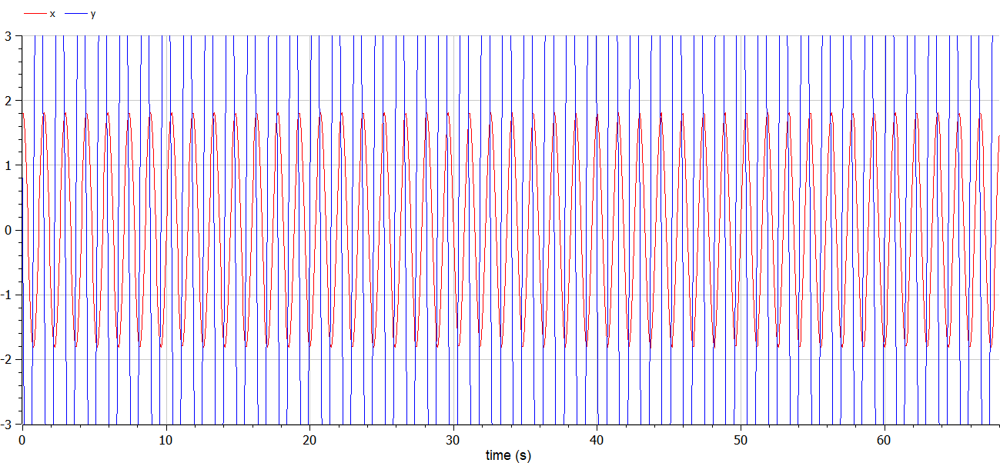{#fig:008 width=70%}

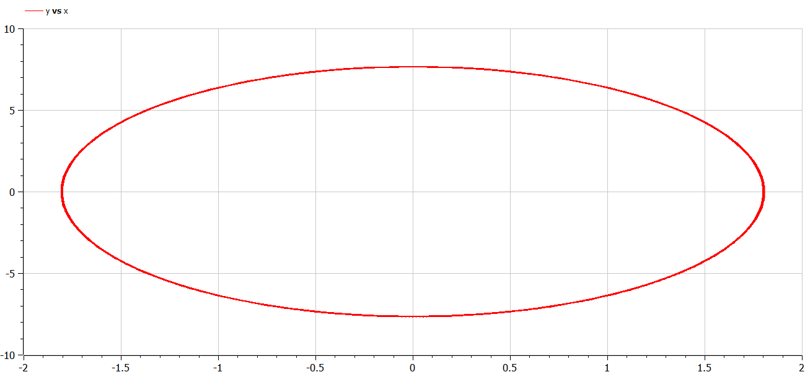{#fig:009 width=70%}

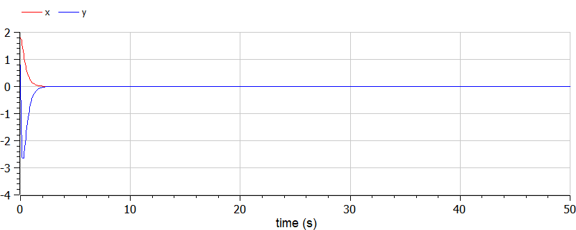{#fig:010 width=70%}

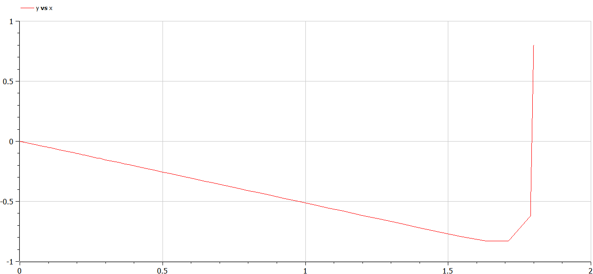{#fig:011 width=70%}

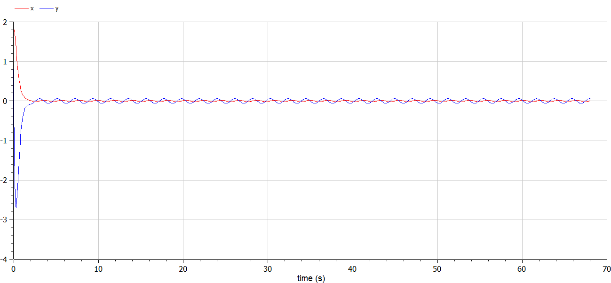{#fig:012 width=70%}

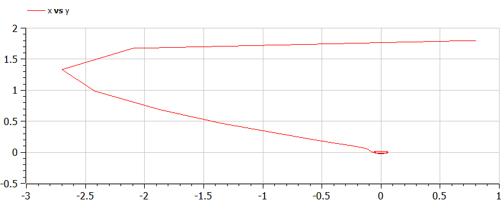{#fig:013 width=70%}

# Выводы

В ходе выполнения лабораторной работы были построены решения уравнения гармонического осциллятора и фазовые портреты гармонических колебаний без затухания, с затуханием и при действии внешней силы на языках Julia и Open Modelica.

# Вопросы к лабораторной работе 

1. Запишите простейшую модель гармонических колебаний

x = x_m cos (ωt + φ0).

2. Дайте определение осциллятора

Осциллятор — система, совершающая колебания, то есть показатели которой периодически повторяются во времени.

3. Запишите модель математического маятника

4. Запишите алгоритм перехода от дифференциального уравнения второго порядка к двум дифференциальным уравнениям первого порядка

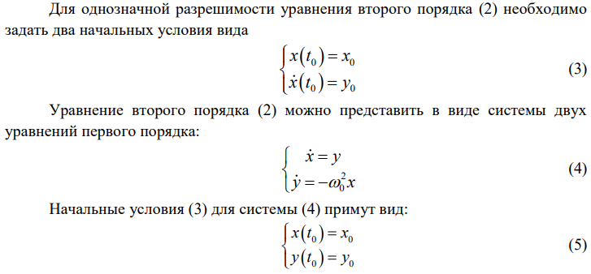{#fig:014 width=70%}

5. Что такое фазовый портрет и фазовая траектория?

Фазовая траектория — след от движения изображающей точки.

Фазовый портрет — это полная совокупность различных фазовых траекторий. Он хорошо иллюстрирует поведение системы и основные ее свойства, такие как точки равновесия.

# Список литературы

[1] Бутиков И. Е. Собственные колебания линейного осциллятора. 2011.

[2] Документация по Julia: https://docs.julialang.org/en/v1/

[3] Документация по OpenModelica: https://openmodelica.org/

