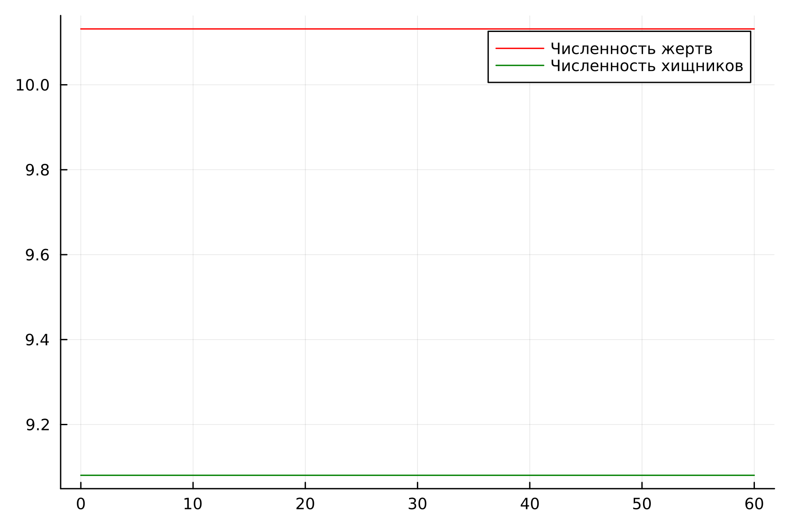
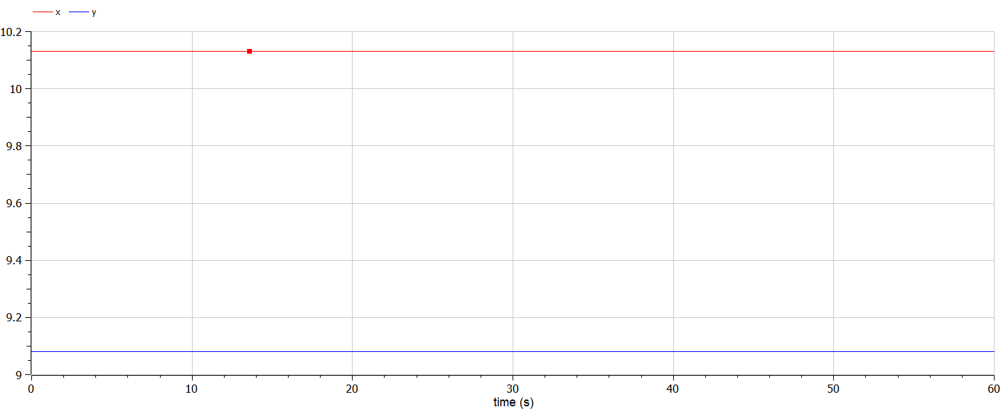
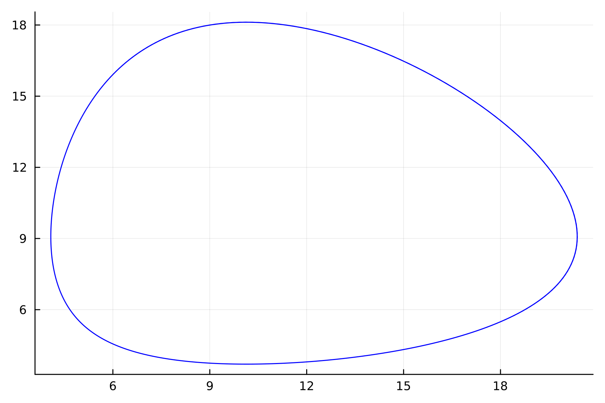
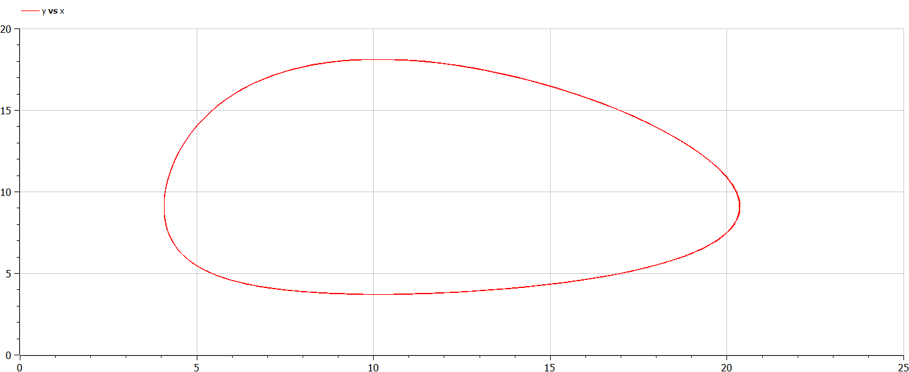
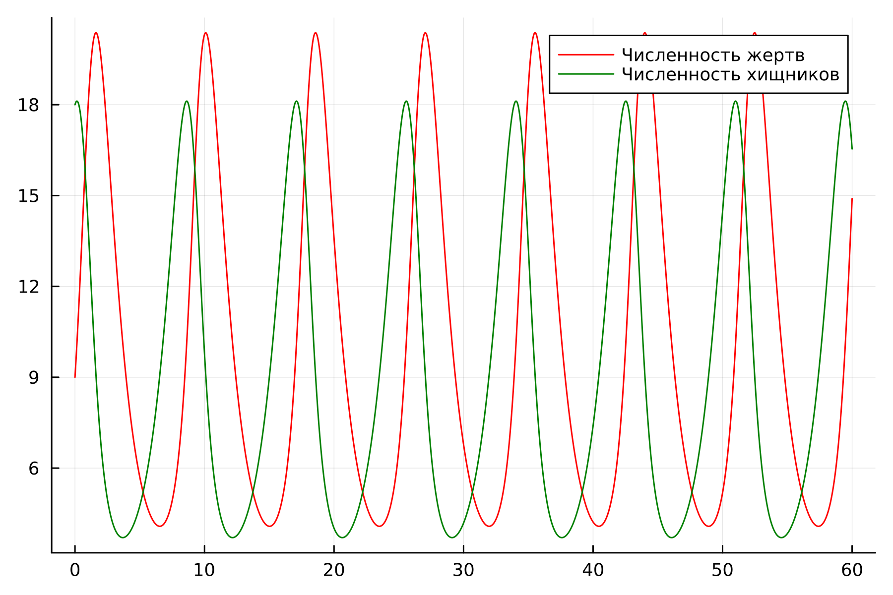
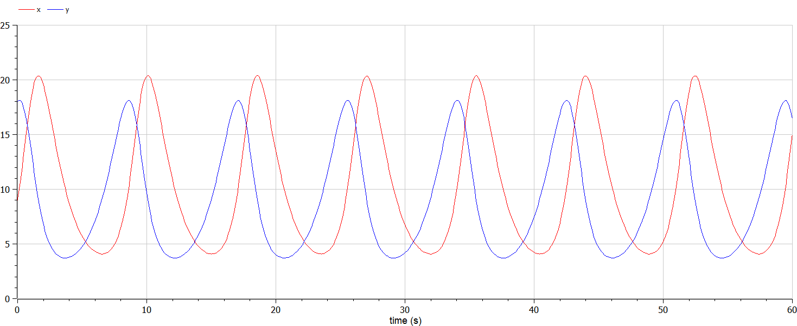

---
## Front matter
lang: ru-RU
title: Лабораторная работа №5
subtitle: "Модель хищник-жертва"
author:
  - Крутова Е. Д.
institute:
  - Российский университет дружбы народов, Москва, Россия
date: 8 марта 2024

## i18n babel
babel-lang: russian
babel-otherlangs: english
mainfont: Arial 
monofont: Courier New 
fontsize: 8pt

## Formatting pdf
toc: false
toc-title: Содержание
slide_level: 2
aspectratio: 169
section-titles: true
theme: metropolis
header-includes:
 - \metroset{progressbar=frametitle,sectionpage=progressbar,numbering=fraction}
 - '\makeatletter'
 - '\beamer@ignorenonframefalse'
 - '\makeatother'
---

# Цель работы

Изучить жесткую модель хищник-жертва и построить эту модель.

# Задание

Для модели «хищник-жертва»:

$\ \frac{dx}{dt}=-0.79x(t)+0.078x(t)y(t)$

$\ \frac{dy}{dt}=0.77y(t)-0.076x(t)y(t)$

Постройте график зависимости численности хищников от численности жертв, а также графики изменения численности хищников и численности жертв при следующих начальных условиях: $\ x_0=9, y_0=18 $ . Найдите стационарное состояние системы.

В соответствии с формулой  (Sn mod N)+1, где Sn — номер студбилета, N — количество заданий, я взяла вариант 37 (рис. [-@fig:001]).

{#fig:001 width=70%}

# Выполнение работы

{#fig:002 width=50%}

# Выполнение работы (1)

{#fig:003 width=35%}

{#fig:004 width=35%}

# Выполнение работы (2)

{#fig:005 width=35%}

{#fig:006 width=35%}

# Выполнение работы (3)

{#fig:007 width=35%}

{#fig:008 width=35%}

# Вывод

В итоге проделанной работы была изучена модель хищник-жертва, и мы построили график зависимости численности хищников от численности жертв, а также графики изменения численности хищников и численности жертв на языках Julia и OpenModelica.
