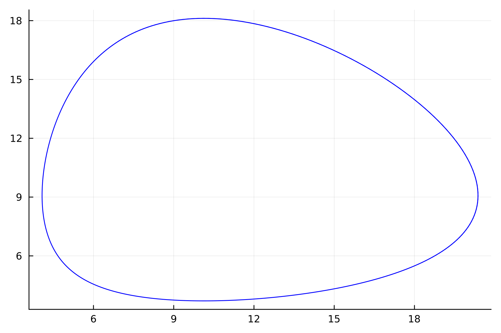
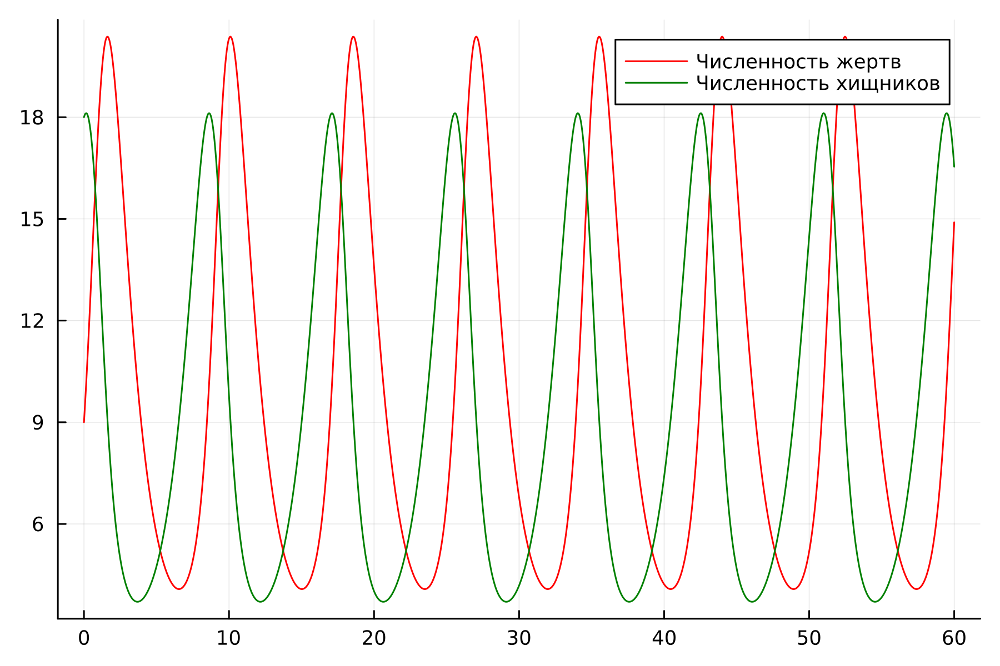
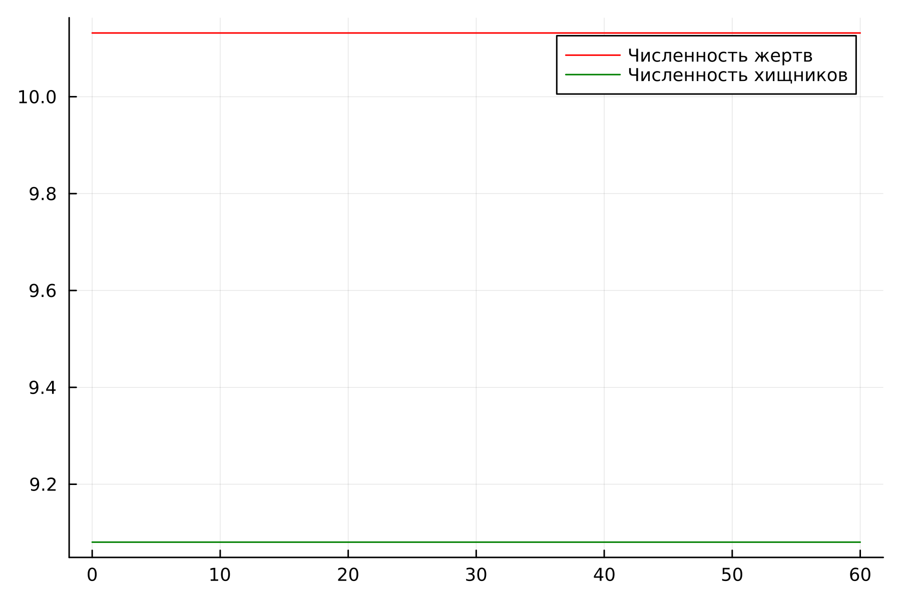
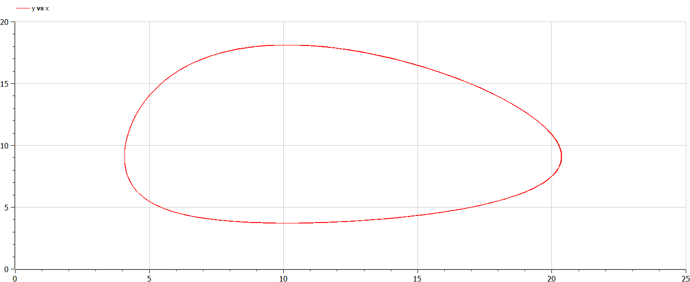
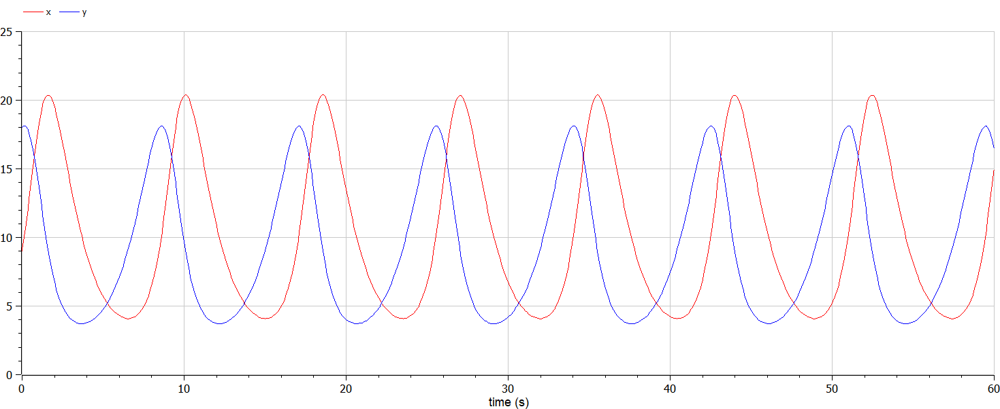
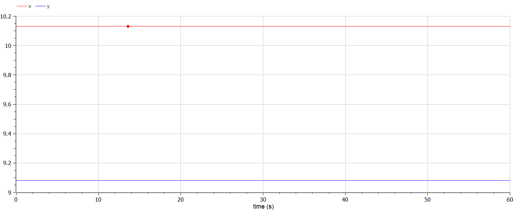

---
## Front matter
title: "Лабораторная работа №5"
subtitle: "Модель хищник-жертва"
author: "Крутова Екатерина Дмитриевна, НПИбд-01-21"

## Generic otions
lang: ru-RU
toc-title: "Содержание"

## Bibliography
bibliography: bib/cite.bib
csl: pandoc/csl/gost-r-7-0-5-2008-numeric.csl

## Pdf output format
toc: true # Table of contents
toc-depth: 2
lof: true # List of figures
lot: true # List of tables
fontsize: 12pt
linestretch: 1.5
papersize: a4
documentclass: scrreprt
## I18n polyglossia
polyglossia-lang:
  name: russian
  options:
	- spelling=modern
	- babelshorthands=true
polyglossia-otherlangs:
  name: english
## I18n babel
babel-lang: russian
babel-otherlangs: english
## Fonts
mainfont: PT Serif
romanfont: PT Serif
sansfont: PT Sans
monofont: PT Mono
mainfontoptions: Ligatures=TeX
romanfontoptions: Ligatures=TeX
sansfontoptions: Ligatures=TeX,Scale=MatchLowercase
monofontoptions: Scale=MatchLowercase,Scale=0.9
## Biblatex
biblatex: true
biblio-style: "gost-numeric"
biblatexoptions:
  - parentracker=true
  - backend=biber
  - hyperref=auto
  - language=auto
  - autolang=other*
  - citestyle=gost-numeric
## Pandoc-crossref LaTeX customization
figureTitle: "Рис."
tableTitle: "Таблица"
listingTitle: "Листинг"
lofTitle: "Список иллюстраций"
lotTitle: "Список таблиц"
lolTitle: "Листинги"
## Misc options
indent: true
header-includes:
  - \usepackage{indentfirst}
  - \usepackage{float} # keep figures where there are in the text
  - \floatplacement{figure}{H} # keep figures where there are in the text
---

# Цель работы

Изучить жесткую модель хищник-жертва и построить эту модель.

# Задание

Для модели «хищник-жертва»:

$\ \frac{dx}{dt}=-0.79x(t)+0.078x(t)y(t)$

$\ \frac{dy}{dt}=0.77y(t)-0.076x(t)y(t)$

Постройте график зависимости численности хищников от численности жертв, а также графики изменения численности хищников и численности жертв при следующих начальных условиях: $\ x_0=9, y_0=18 $ . Найдите стационарное состояние системы.

В соответствии с формулой  (Sn mod N)+1, где Sn — номер студбилета, N — количество заданий, я взяла вариант 37 (рис. [-@fig:001]).

{#fig:001 width=70%}

# Теоретическое введение

- Модель Лотки—Вольтерры — модель взаимодействия двух видов типа «хищник — жертва», названная в честь её авторов, которые предложили модельные уравнения независимо друг от друга. Такие уравнения можно использовать для моделирования систем «хищник — жертва», «паразит — хозяин», конкуренции и других видов взаимодействия между двумя видами. [1]

Данная двувидовая модель основывается на следующих предположениях [1]:

* Численность популяции жертв x и хищников y зависят только от времени (модель не учитывает пространственное распределение популяции на занимаемой территории)

* В отсутствии взаимодействия численность видов изменяется по модели Мальтуса, при этом число жертв увеличивается, а число хищников падает

* Естественная смертность жертвы и естественная рождаемость хищника считаются несущественными

* Эффект насыщения численности обеих популяций не учитывается

* Скорость роста численности жертв уменьшается пропорционально численности хищников.

Данная модель описывается следующим уравнением:

$\ \frac{dx}{dt}=-ax(t)+bx(t)y(t)$

$\ \frac{dy}{dt}=cy(t)+dx(t)y(t)$, где

a, d - коэффициенты смертности

b, c - коэффициенты прироста популяции


# Выполнение лабораторной работы

## Выполнение с помощью Julia

Код программы для нестационарного состояния::

```
  using Plots
using DifferentialEquations

x0 = 9
y0 = 18

a = 0.79
b = 0.087
c = 0.77
d = 0.076


function ode_fn(du, u, p, t)
    x, y = u
    du[1] = -a*u[1] + b * u[1] * u[2]
    du[2] = c * u[2] - d * u[1] * u[2]
end

v0 = [x0, y0]
tspan = (0.0, 60.0)
prob = ODEProblem(ode_fn, v0, tspan)
sol = solve(prob, dtmax=0.05)
X = [u[1] for u in sol.u]
Y = [u[2] for u in sol.u]
T = [t for t in sol.t]

plt = plot(
  dpi=300,
  legend=false)

plot!(
  plt,
  X,
  Y,
  color=:blue)

savefig(plt, "lab05ns1_jl.png")

plt2 = plot(
  dpi=300,
  legend=true)

plot!(
  plt2,
  T,
  X,
  label="Численность жертв",
  color=:red)

plot!(
  plt2,
  T,
  Y,
  label="Численность хищников",
  color=:green)

savefig(plt2, "lab05ns2_jl.png")
```

Код программы для стационарного состояния::

```
using Plots
using DifferentialEquations

a = 0.79
b = 0.087
c = 0.77
d = 0.076

x0 = c / d 
y0 = a / b 

function ode_fn(du, u, p, t)
    x, y = u
    du[1] = -a*u[1] + b * u[1] * u[2]
    du[2] = c * u[2] - d * u[1] * u[2]
end

v0 = [x0, y0]
tspan = (0.0, 60.0)
prob = ODEProblem(ode_fn, v0, tspan)
sol = solve(prob, dtmax=0.05)
X = [u[1] for u in sol.u]
Y = [u[2] for u in sol.u]
T = [t for t in sol.t]

plt2 = plot(
  dpi=300,
  legend=true)

plot!(
  plt2,
  T,
  X,
  label="Численность жертв",
  color=:red)

plot!(
  plt2,
  T,
  Y,
  label="Численность хищников",
  color=:green)

savefig(plt2, "lab05s_jl.png")
```

Полученные графики (рис. [-@fig:002] - [-@fig:004]).

{#fig:002 width=70%}

{#fig:003 width=70%}

{#fig:004 width=70%}


## Выполнение с помощью OpenModelica

Код программы для нестационарного состояния::

```
model lab05_1
Real a = 0.79;
Real b = 0.087;
Real c = 0.77;
Real d = 0.076;
Real x;
Real y;
initial equation
x = 9;
y = 18;
equation
der(x) = -a*x + b*x*y;
der(y) = c*y - d*x*y;
end lab05_1;
```

Код программы для стационарного состояния::

```
model lab05_2
Real a = 0.79;
Real b = 0.087;
Real c = 0.77;
Real d = 0.076;
Real x;
Real y;
initial equation
x = c/d;
y = a/b;
equation
der(x) = -a*x + b*x*y;
der(y) = c*y - d*x*y;
end lab05_2;
```

Полученные графики (рис. [-@fig:005] - [-@fig:007]).

{#fig:005 width=70%}

{#fig:006 width=70%}

{#fig:007 width=70%}

# Выводы

В итоге проделанной работы была изучена модель хищник-жертва, и мы построили график зависимости численности хищников от численности жертв, а также графики изменения численности хищников и численности жертв на языках Julia и OpenModelica.

# Список литературы

[1] Документация по Julia: https://docs.julialang.org/en/v1/

[2] Документация по OpenModelica: https://openmodelica.org/

[3] Решение дифференциальных уравнений: https://www.wolframalpha.com/

[4] Модель Лотки—Вольтерры: https://math-it.petrsu.ru/users/semenova/MathECO/Lections/Lotka_Volterra.pdf