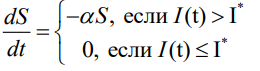
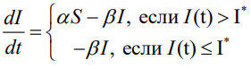
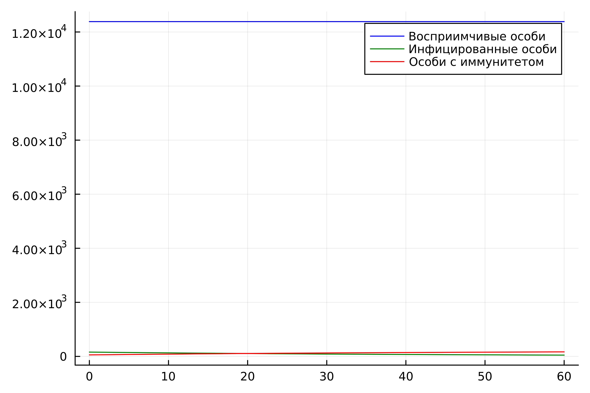
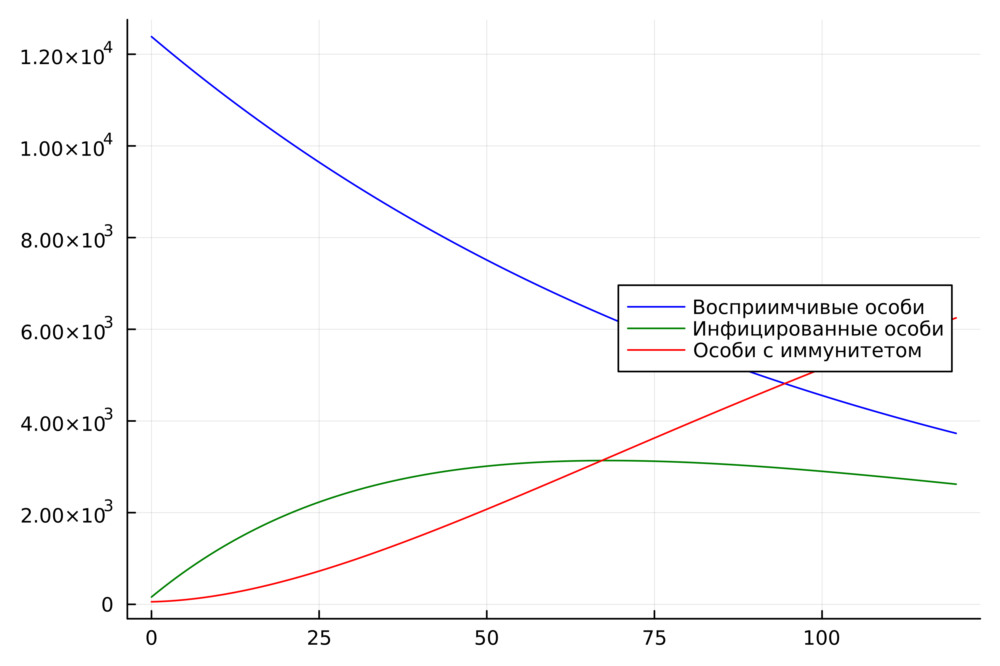
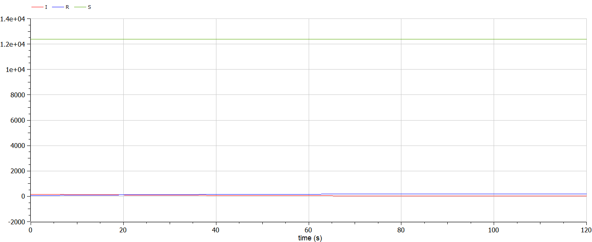
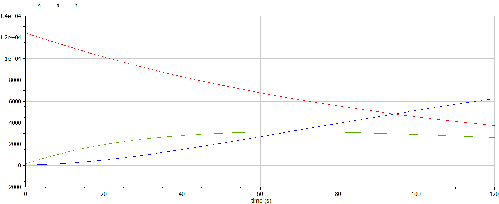

---
## Front matter
title: "Лабораторная работа №6"
subtitle: "Модель эпидемии"
author: "Крутова Екатерина Дмитриевна, НПИбд-01-21"

## Generic otions
lang: ru-RU
toc-title: "Содержание"

## Bibliography
bibliography: bib/cite.bib
csl: pandoc/csl/gost-r-7-0-5-2008-numeric.csl

## Pdf output format
toc: true # Table of contents
toc-depth: 2
lof: true # List of figures
lot: true # List of tables
fontsize: 12pt
linestretch: 1.5
papersize: a4
documentclass: scrreprt
## I18n polyglossia
polyglossia-lang:
  name: russian
  options:
	- spelling=modern
	- babelshorthands=true
polyglossia-otherlangs:
  name: english
## I18n babel
babel-lang: russian
babel-otherlangs: english
## Fonts
mainfont: PT Serif
romanfont: PT Serif
sansfont: PT Sans
monofont: PT Mono
mainfontoptions: Ligatures=TeX
romanfontoptions: Ligatures=TeX
sansfontoptions: Ligatures=TeX,Scale=MatchLowercase
monofontoptions: Scale=MatchLowercase,Scale=0.9
## Biblatex
biblatex: true
biblio-style: "gost-numeric"
biblatexoptions:
  - parentracker=true
  - backend=biber
  - hyperref=auto
  - language=auto
  - autolang=other*
  - citestyle=gost-numeric
## Pandoc-crossref LaTeX customization
figureTitle: "Рис."
tableTitle: "Таблица"
listingTitle: "Листинг"
lofTitle: "Список иллюстраций"
lotTitle: "Список таблиц"
lolTitle: "Листинги"
## Misc options
indent: true
header-includes:
  - \usepackage{indentfirst}
  - \usepackage{float} # keep figures where there are in the text
  - \floatplacement{figure}{H} # keep figures where there are in the text
---

# Цель работы

Изучить и построить модель эпидемии.

# Задание

В соответствии с формулой  (Sn mod N)+1, где Sn — номер студбилета, N — количество заданий, я взяла вариант 37 (рис. [-@fig:001]).

{#fig:001 width=70%}

На одном острове вспыхнула эпидемия. Известно, что из всех проживающих на острове (N=12 600) в момент начала эпидемии (t=0) число заболевших людей (являющихся распространителями инфекции) I(0)=160, А число здоровых людей с иммунитетом к болезни R(0)=56. Таким образом, число людей восприимчивых к болезни, но пока здоровых, в начальный момент времени S(0)=N-I(0)- R(0).

Постройте графики изменения числа особей в каждой из трех групп. Рассмотрите, как будет протекать эпидемия в случае:

1) если I(0) <= I*,

2) если I(0) > I*.

# Теоретическое введение

Рассмотрим простейшую модель эпидемии. Предположим, что некая популяция, состоящая из N особей, (считаем, что популяция изолирована) подразделяется на три группы. Первая группа - это восприимчивые к болезни, но 
пока здоровые особи, обозначим их через S(t). Вторая группа – это число инфицированных особей, которые также при этом являются распространителями инфекции, обозначим их I(t). А третья группа, обозначающаяся через R(t) – это здоровые особи с иммунитетом к болезни. До того, как число заболевших не превышает критического значения I*, считаем, что все больные изолированы и не заражают здоровых. Когда I(t) > I*,
тогда инфицирование способны заражать восприимчивых к болезни особей. Таким образом, скорость изменения числа S(t) меняется по следующему закону:

{#fig:002 width=70%}

Поскольку каждая восприимчивая к болезни особь, которая, в конце концов, заболевает, сама становится инфекционной, то скорость изменения числа инфекционных особей представляет разность за единицу времени между заразившимися и теми, кто уже болеет и лечится, т.е.:

{#fig:003 width=70%}

# Выполнение лабораторной работы

## Выполнение с помощью Julia

Случай, если если I(0) <= I*:

```
using Plots
using DifferentialEquations

N = 12600
I0 = 160 # заболевшие особи
R0 = 56 # особи с иммунитетом
S0 = N - I0 - R0 # здоровые, но восприимчивые особи
alpha = 0.01 # коэффициент заболеваемости
beta = 0.02 # коэффициент выздоровления

#I0 <= I*
function ode_fn(du, u, p, t)
    S, I, R = u
    du[1] = 0
    du[2] = -beta*u[2]
    du[3] = beta*I
end

v0 = [S0, I0, R0]
tspan = (0.0, 60.0)
prob = ODEProblem(ode_fn, v0, tspan)
sol = solve(prob, dtmax = 0.05)
S = [u[1] for u in sol.u]
I = [u[2] for u in sol.u]
R = [u[3] for u in sol.u]
T = [t for t in sol.t]
plt = plot(
  dpi = 600,
  legend = :topright)
plot!(
  plt,
  T,
  S,
  label = "Восприимчивые особи",
  color = :blue)
plot!(
  plt,
  T,
  I,
  label = "Инфицированные особи",
  color = :green)
plot!(
  plt,
  T,
  R,
  label = "Особи с иммунитетом",
  color = :red)

savefig(plt, "lab06_1.png")
```

Случай, если если I(0) > I*:

```
using Plots
using DifferentialEquations

N = 12600
I0 = 160 # заболевшие особи
R0 = 56 # особи с иммунитетом
S0 = N - I0 - R0 # здоровые, но восприимчивые особи
alpha = 0.01 # коэффициент заболеваемости
beta = 0.02 # коэффициент выздоровления

#I0 > I*
function ode_fn(du, u, p, t)
    S, I, R = u
    du[1] = -alpha*u[1]
    du[2] = alpha*u[1] - beta*u[2]
    du[3] = beta*I
end

v0 = [S0, I0, R0]
tspan = (0.0, 120.0)
prob = ODEProblem(ode_fn, v0, tspan)
sol = solve(prob, dtmax=0.05)
S = [u[1] for u in sol.u]
I = [u[2] for u in sol.u]
R = [u[3] for u in sol.u]
T = [t for t in sol.t]

plt = plot(
  dpi=600,
  legend=:right)

plot!(
  plt,
  T,
  S,
  label="Восприимчивые особи",
  color=:blue)
plot!(
  plt,
  T,
  I,
  label="Инфицированные особи",
  color=:green)
plot!(
  plt,
  T,
  R,
  label="Особи с иммунитетом",
  color=:red)


savefig(plt, "lab06_2.png")
```

Полученные графики (рис. [-@fig:004] - [-@fig:005]).

{#fig:004 width=70%}

{#fig:005 width=70%}

## Выполнение с помощью OpenModelica

Случай, если если I(0) <= I*:

```
model lab06_1
Real N = 12600;
Real I;
Real R;
Real S;
Real alpha = 0.01;
Real beta = 0.02;
initial equation
I = 160;
R = 56;
S = N - I - R;
equation
der(S) = 0;
der(I) = -beta*I;
der(R) = beta*I;
end lab06_1;
```

Случай, если если I(0) > I*:

```
model lab06_2
Real N = 12600;
Real I;
Real R;
Real S;
Real alpha = 0.01;
Real beta = 0.02;
initial equation
I = 160;
R = 56;
S = N - I - R;
equation
der(S) = -alpha*S;
der(I) = alpha*S - beta*I;
der(R) = beta*I;
end lab06_2;
```

Полученные графики (рис. [-@fig:006] - [-@fig:007]).

{#fig:006 width=70%}

{#fig:007 width=70%}

# Выводы

В ходе выполнения лабораторной работы была изучена модель эпидемии и построена модель на языках Julia и Open Modelica. В итоге проделанной работы мы построили графики зависимости численности особей трех групп S, I, R для случаев, когда больные изолированы и когда они могут заражать особей группы S.

# Список литературы

[1] Документация по Julia: https://docs.julialang.org/en/v1/

[2] Документация по OpenModelica: https://openmodelica.org/

[3] Решение дифференциальных уравнений: https://www.wolframalpha.com/

[4] Конструирование эпидемиологических моделей: https://habr.com/ru/post/551682/