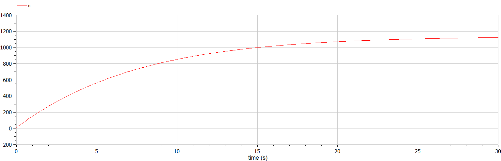

---
## Front matter
title: Доклад на тему "Игра полковника Блотто"
subtitle: "Дисциплина: 'Математическое моделирование'"
author: "Крутова Екатерина Дмитриевна"

## Generic otions
lang: ru-RU
toc-title: "Содержание"

## Bibliography
bibliography: bib/cite.bib
csl: pandoc/csl/gost-r-7-0-5-2008-numeric.csl

## Pdf output format
toc: true # Table of contents
toc-depth: 2
lof: true # List of figures
lot: true # List of tables
fontsize: 13pt
linestretch: 1.5
papersize: a4
documentclass: scrreprt
## I18n polyglossia
polyglossia-lang:
  name: russian
  options:
	- spelling=modern
	- babelshorthands=true
polyglossia-otherlangs:
  name: english
## I18n babel
babel-lang: russian
babel-otherlangs: english
## Fonts
mainfont: PT Serif
romanfont: PT Serif
sansfont: PT Sans
monofont: PT Mono
mainfontoptions: Ligatures=TeX
romanfontoptions: Ligatures=TeX
sansfontoptions: Ligatures=TeX,Scale=MatchLowercase
monofontoptions: Scale=MatchLowercase,Scale=0.9
## Biblatex
biblatex: true
biblio-style: "gost-numeric"
biblatexoptions:
  - parentracker=true
  - backend=biber
  - hyperref=auto
  - language=auto
  - autolang=other*
  - citestyle=gost-numeric
## Pandoc-crossref LaTeX customization
figureTitle: "Рис."
tableTitle: "Таблица"
listingTitle: "Листинг"
lofTitle: "Список иллюстраций"
lotTitle: "Список таблиц"
lolTitle: "Листинги"
## Misc options
indent: true
header-includes:
  - \usepackage{indentfirst}
  - \usepackage{float} # keep figures where there are in the text
  - \floatplacement{figure}{H} # keep figures where there are in the text
---

# Введение

В современном мире математическое моделирование играет ключевую роль в анализе стратегий, принятии решений и предсказании результатов в различных сферах, начиная от экономики и финансов и заканчивая военной тактикой и социальными взаимодействиями. В этом контексте игра "Полковник Блотто" становится объектом интереса исследователей, предоставляя уникальную возможность изучения стратегического мышления и оптимальных решений. Актуальность темы обусловлена не только теоретическими аспектами, но и практической применимостью в различных областях, таких как экономика, бизнес и военная стратегия. Объектом моего исследования является игра полковника Блотто, а предметом исследования - изучение математических моделей и стратегий для оптимальной игры.

Цель данного доклада - рассмотреть математическое моделирование игры "Полковник Блотто" и его применение в анализе стратегий игроков. В ходе работы будет проведен обзор основных концепций игры, математическая формализация задачи, рассмотрены возможные приложения результатов анализа в реальных ситуациях.

# Обзор игры

Игра полковника Блотто была впервые опубликована Эмилем Борелем в 1921 году [1]. В 1938 году Борелем и Вилле было описано равновесие в смешанных стратегиях в игре с симметричными игроками и числом полей k = 3, а в 1950 году Госс и Вагнер описали равновесие в смешанных стратегиях в играх с симметричными игроками и любым числом полей и с асимметричными игроками для случая k = 2.

Данная игра относится к классу игр двух игроков с нулевой суммой, это стратегическая модель-загадка, найти решение которой крайне непросто. Смысл заключается в одновременном распределении ограниченного количества ресурсов по нескольким объектам (битвам), в классической версии — необходимо сделать расстановку солдат на поле боя. Выигрыш в игре составляет количество побед в битвах, а победа в битве определяется количеством выставленных ресурсов — кто больше выставил на конкретную битву, тот и победил в ней.

Игра не имеет однозначного математического решения: решения подходят только для некоторых конкретных случаев и, как бы ни распределил свои ресурсы тот, у кого их больше, второй игрок сможет распределить свои ресурсы так, чтобы выиграть в некоторых битвах, кроме случая, когда у первого игрока настолько больше ресурсов, что их деление на количества битв всё равно было больше общего количества ресурсов у второго игрока.

# Математическая формализация игры

## Цели математического моделирования игры

Цель математического моделирования игры "Полковник Блотто" состоит в анализе и определении оптимальных стратегий для каждого игрока при различных условиях игры. Основной задачей является определение стратегий, которые максимизируют вероятность выигрыша для каждого игрока. Математическое моделирование позволяет исследовать различные варианты распределения ресурсов и определить оптимальные стратегии в зависимости от текущего состояния игры. Другой важной целью является прогнозирование исходов игры в зависимости от выбранных стратегий игроков. Математическое моделирование даёт возможность оценить вероятность победы для каждого игрока и предсказать исходы игры в различных сценариях.

Для достижения поставленных целей можно использовать различные методы математического моделирования, включая теорию игр - для анализа стратегий и определения оптимальных решений и линейное программирование- для оптимизации стратегий при ограничениях на распределение ресурсов. Также для прогнозирования вероятности выигрыша при различных вариантах распределения ресурсов используются вероятностные модели.

## Пример математического описания игры 1

Модель полковника Блотто может быть реализована в виде матрицы, где строки представляют распределение ресурсов одного игрока, а столбцы - распределение ресурсов другого игрока. Путем анализа этой матрицы можно определить лучшие стратегии для каждого игрока при данных условиях и прогнозировать исходы игры в зависимости от различных вариантов распределения ресурсов.

Рассмотрим задачу под названием Оборона города.

Полковник Блотто (игрок A) имеет 4 полка, а его противник (B) – 3 полка. Противник защищает k = 2 позиции. Позиция будет занята полковником Блотто, если на ней наступающие полки окажутся в численном превосходстве. При этом, если у полковника Блотто на позиции полков больше, чем у противника, то его выигрыш на этой позиции равен числу полков противника плюс один (за захват позиции). Если у B полков больше, то A теряет все свои полки и 1 за позицию. Если число полков A и B на позиции одинаково, то имеет место ничья и никто ничего не получает.

Необходимо сформировать матрицу игры, считая, что суммарный выигрыш A ($\ h_\beta ^A (x, y)$ ) равен сумме его выигрышей по двум позициям и игра является антагонистической.

Решение:

Стратегией первого игрока является пара $\ (x_1, x_2)$, $\ x_1+x_2=4$, где $\ x_1$– число полков, отправленных Блотто на позицию 1, $\ x_2$ – на позицию 2. Тогда X = {(4, 0), (3, 1),...(0, 4)}. Аналогично для второго игрока Y = {(0, 3),...(3, 0)}. Матрица игры будет иметь следующий вид, показанный на рис. [-@fig:001]:

{#fig:001 width=70%}

На примере $\ a_{1,3}$ – величины выигрыша A при условии, что он предпринял стратегию (4,0), а второй игрок стратегию (1,2). На первой позиции полки полковника Блотто оказываются в численном превосходстве (4>1), поэтому он выигрывает число полков противника (1) плюс 1 за захват позиции (всего выигрыш по позиции равен 2). На второй позиции наоборот, полки B оказываются в превосходстве (0<2) и тогда Блотто теряет все свои полки на этой позиции (0) и 1 за поражение на позиции (всего выигрыш по позиции равен -1). Суммарный выигрыш Блотто по двум позициям: $\ a_{1,3}=2-1=1$. Аналогично формируются остальные элементы матрицы.

## Пример математического описания игры 2

Рассмотрим дискретный вариант игры двух игроков A и B, которые распределяют a и b войск соответственно на k полях. Чистые стратегии игроков A и B могут быть представлена в виде векторов $\ x = (x_1...x_k)$ и $\ x = (x_1...x_k)$ из k ненулевых чисел, где $\ \sum_{i \in[ k ]} x_i = m$ и $\ \sum_{i \in[ k ]} x_i = n$ соответственно. В дискретном варианте игры количество войск, назначенных на каждое из полей сражений, должно быть неотрицательными целыми числами. В непрерывном варианте любое назначение с неотрицательными действительными значениями считается действительным.

Пусть x и y - чистые стратегии, в которые играют соответственно игрок 1 и игрок 2. Игрок 1 выигрывает сражение i, если $\ x_i > y_i$, и проигрывает в противном случае. Победитель i-ого сражения получает победные очки $\ w_i$ от этого поле боя, и общее количество победных очков каждого игрока равна сумме его победых очков на всех полях сражений. Точнее, общее количество победных очков игроков 1 и 2, которые мы соответственно обозначаем $\ h_\beta ^A (x, y)$ и $\ h_\beta ^ B(x, y)$, следующие:

$\ h_\beta ^A (x, y) = \sum_i w_i ^A (x_i, y_i)$

$\ h_\beta ^B (x, y) = \sum_i w_i ^B (x_i, y_i)$ [2]

Мы можем рассмотреть частный случай игры Блотто, в котором все выигрыши сражений имеют одинаковые веса, т.е. $\ w_1 = w_2 = . . . = w_k = 1.$

Смешанная стратегия каждого игрока представляла бы собой распределение вероятностей по его чистым стратегиям [2].

Для нахождения смешанных решений игры можно использовать метод переменного базиса, для чего используется приведение матричной игры к задаче линейного программирования.

# Применение в реальной жизни

Результаты анализа игры "Полковник Блотто" могут быть применены в различных сферах. Например, в военном планировании с его помощью можно оптимизировать размещение и распределения военных ресурсов, стратегии, разработанные на основе математического моделирования игры, могут помочь в принятии решений о том, как лучше разместить вооружение и войска для максимизации эффективности военных операций.

Анализ игры "Полковник Блотто" может также помочь при разработке стратегий управления портфелем в инвестиционной сфере. Путем моделирования различных вариантов распределения капитала можно определить оптимальные стратегии инвестирования с целью максимизации прибыли и управления риском.

Ещё одна возможная область применения это разработка маркетинговых стратегий и прогнозирование реакции конкурентов на различные маркетинговые действия. Например, компании могут использовать моделирование игры для определения оптимального распределения рекламного бюджета между различными каналами связи с клиентами.

Эта игра обычно используется как метафора предвыборной конкуренции, когда две политические партии выделяют деньги или ресурсы для привлечения поддержки фиксированного числа избирателей [3]. С помощью модели «Полковника Блотто» кандидат может увидеть, на какие области лучше расставить акценты во время политической кампании и достаточно ли ресурсов направлено на ту или иную область. Алгоритм не даст гарантированных предсказаний, но поможет выбрать правильную стратегию поведения во время президентской гонки. Президентские выборы в США в 2000 году, одни из самых близких по рейтингу претендентов, были смоделированы как Игра Блотто [4].

Та же игра также находит применение в теории аукционов, где участники торгов должны делать одновременные ставки [5].

# Выводы

В ходе данного исследования мы рассмотрели игру "Полковник Блотто" с точки зрения математического моделирования. Мы изучили историю и основные концепции игры, сформулировали задачи математического моделирования, представили математическое описание игровых состояний и действий игроков, а также обсудили возможные применения в реальной жизни.

Сводка основных результатов и выводов работы позволяет увидеть следующее:
математическое моделирование игры "Полковник Блотто" предоставляет возможность анализа стратегий игры и прогнозирования исходов, что может быть полезно в различных областях, требующих принятия решений при ограниченных ресурсах и неопределенности.

Мы обсудили примеры применения результатов анализа игры "Полковник Блотто" в реальных ситуациях, таких как военное планирование, стратегическое управление ресурсами, экономические конкуренции и торговые стратегии.

В дальнейших исследованиях темы игры "Полковник Блотто" можно расширить, изучив более сложные варианты игры, учитывая дополнительные факторы и усложняя моделирование. Также возможно применение более продвинутых математических методов для анализа игры и прогнозирования исходов, и поиск однозначного математического решения.

# Список литературы{.unnumbered}

1. Borel, Émile. "The Theory of Play and Integral Equations with Skew Symmetric Kernels." Econometrica 21.1, 1953. JSTOR Journals. The Econometric Society. [Электронный ресурс] URL: <http://www.jstor.org/stable/1906946> (дата обращения: 13.03.2024)

2. A. Ahmadinejad, S. Dehghani, M. Hajiaghay, B. Lucier, H. Mahini, and S. Seddighin, “From Duels to Battlefields: Computing Equilibria of Blotto and Other Games”, AAAI, vol. 30, no. 1, Feb. 2016.

3. Laslier, J.-F.; Picard, N. (2002). "Distributive politics and electoral competition". Journal of Economic Theory. 103: 106–130.

4. Merolla, Jennifer, Michael Munger, and Michael Tofias. "Lotto, Blotto, or Frontrunner: An Analysis of Spending Patterns by the National Party Committees in the 2000 Presidential Election". Midwest Political Science Association. Palmer House, Chicago, IL. 6 Apr. 2003. [Электронный ресурс] URL: <https://web.archive.org/web/20080407161417/http://www.socsci.duke.edu/ssri/federalism/papers/tofiasmunger.pdf> (дата обращения: 13.03.2024)

5. Szentes, B.; Rosenthal, R. (2003). "Three-object, Two-Bidder Simultaneous Auctions: Chopsticks and Tetrahedra". Games and Economic Behavior. 44: 114–133

